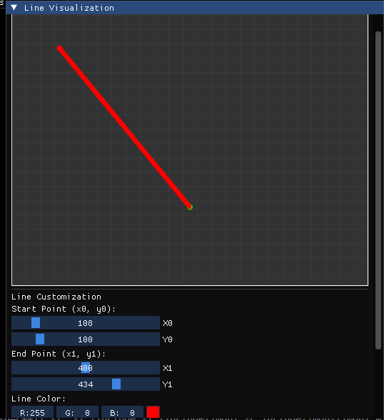
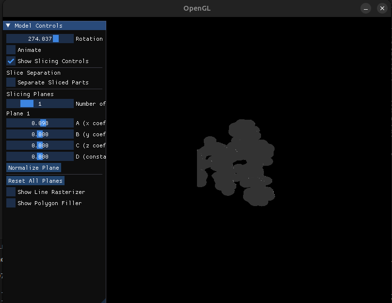
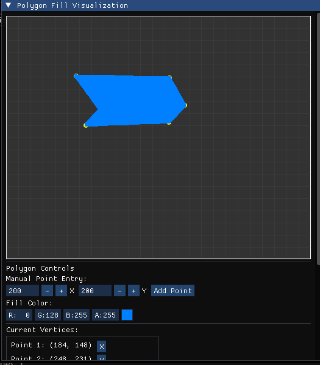

## Model Viewer with Interactive Slicing

The project also includes an interactive 3D model viewer implemented in `main.cpp` that allows real-time model visualization and manipulation.

### Features

1. **3D Model Visualization**
   - Loads and displays 3D models from OFF files
   - Computes and uses surface normals for proper lighting
   - Supports model rotation for full view inspection

2. **Interactive Model Slicing**
   - Up to 4 slicing planes can be applied simultaneously
   - Real-time control of each plane's equation (ax + by + cz + d = 0)
   - Option to separate sliced parts for better visualization
   - Adjustable separation distance

3. **2D Graphics Tools**
   - **Line Rasterizer**: Implements and visualizes the Bresenham line algorithm
   - **Polygon Filler**: Interactive polygon creation and filling using scan-line algorithm

### User Interface

The application uses ImGui for an interactive user interface with the following controls:

1. **Model Controls Panel**
   - Rotation slider: Rotate the model around the Y-axis
   - Animation toggle: Enable/disable automatic rotation

2. **Slicing Controls**
   - Number of active planes (0-4)
   - Per-plane equation controls (A, B, C, D coefficients)
   - Plane normalization option
   - Separation toggle and distance adjustment

3. **Line Rasterizer**
   - Interactive line endpoints control
   - Color selection
   - Real-time line information (slope, direction, length)
   - Visual representation of rasterized pixels

4. **Polygon Filler**
   - Click on canvas to add vertices
   - Manual coordinate entry
   - Color selection for fill
   - Vertex management (view, delete)
   - Real-time filled polygon visualization

### Keyboard Controls

- **R**: Reset rotation
- **Q/ESC**: Exit application

### Technical Implementation

The application uses:
- OpenGL for 3D rendering
- GLSL shaders for model visualization and slicing
- GLFW for window management
- ImGui for the user interface
- Custom implementations of line rasterization and polygon filling algorithms

## Directory Structure

The project is organized into the following directory structure:

```
assignment-3-shubhamZXCV/
├── include/              # External libraries and header files
│   ├── imgui/            # Dear ImGui library files
│   └── ...               # Other included libraries
├── models/               # 3D model files in OFF format
│   ├── 1grm.off
│   ├── 2oar.off
│   ├── 3sy7.off
│   ├── 4hhb.off
│   └── ...

├── shaders/              # GLSL shader files
│   ├── shader.vs         # Vertex shader
│   ├── shader.fs         # Fragment shader
│   └── shader.gs         # Geometry shader for slice visualization
├── file_utils.h          # File utilities
├── line_rasterizer.h     # Bresenham line rasterization
├── main.cpp              # Main application with 3D model viewing
├── math_utils.h          # Mathematical utilities
├── OFFReader.h           # OFF file format reader
├── polygon_filler.h      # Polygon filling algorithm
├── Makefile
├── README.md
└── ...
```

### Building and Running the Model Viewer

To compile and run the 3D model viewer application:

```bash
# Build using the provided Makefile
make

# Run the compiled program
./sample
```

The application will open a window displaying a 3D model with interactive controls for rotation, slicing, line rasterization, and polygon filling.


