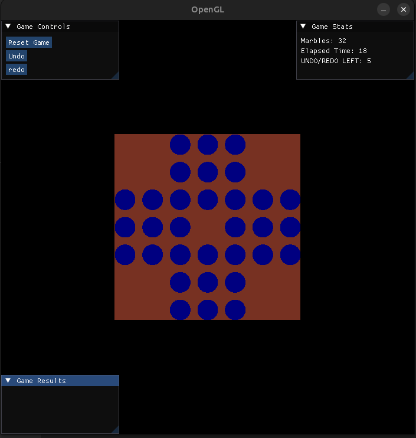

> To know more about this project refer to the assignment1.pdf in this folder : )


### Instructions to Run the Code

* Prerequisites:

```bash
# Install required dependencies
sudo apt-get install libglfw3-dev libglew-dev
```

* Build and run

```bash
make 
./sample
```

### ImGui Integration
 ImGui was incorporated to create three main UI windows:

1. Game Controls (Top-Left):

* Reset Game button
* Undo/Redo moves with limit counter
* Simple interface for game actions

2. Game Stats (Top-Right):

* Displays remaining marbles
* Shows elapsed time
* Shows remaining undo/redo moves

3. Game Results (Bottom-Left):

* Shows game over state
* Displays win condition when achieved

Integration was done using:

```cpp
// Initialize ImGui
InitImGui(window);
// Render loop includes
RenderImGui();

```

### Challenging Components
1. Mouse Click Detection:

* Converting window coordinates to grid indices was tricky
* Required careful calculation of grid positions
* Needed multiple iterations to get accurate click detection

2. Move Validation:

* Implementing valid move checks
* Tracking captured marbles
* Managing game state

3. Undo/Redo System:

* Implementing move history
* Managing state restoration
* Limiting number of moves


