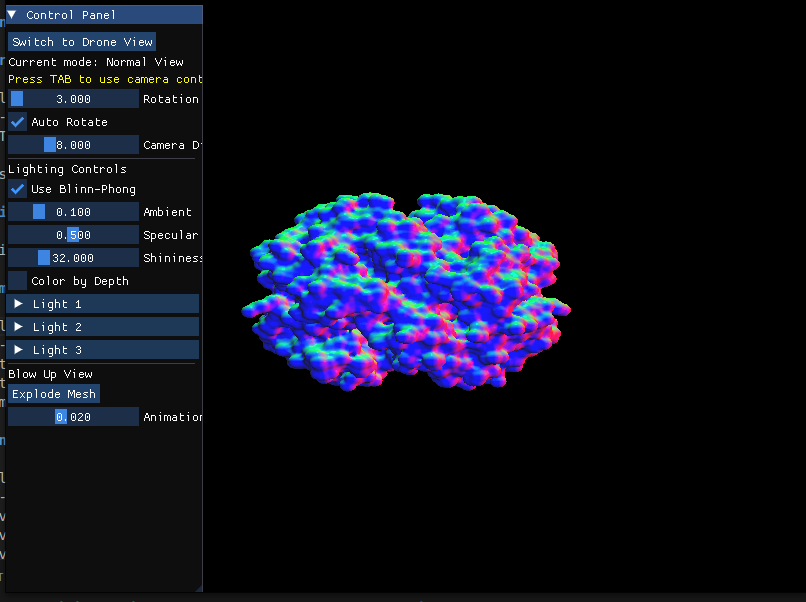
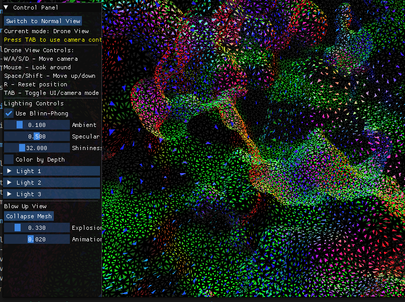

# 🧬 OpenGL Protein Visualization

This application allows for interactive visualization of 3D protein models with multiple lighting and view options.

## 🎮 Controls

### General Navigation

| Control | Description |
|---------|-------------|
| TAB | Toggle between UI mode and Camera control mode |
| ESC or Q | Exit the application |
| R | Reset camera position and rotation |

### 🔍 View Mode Controls

The application supports two main view modes - Normal View and Drone View.

#### Normal View

| Control | Description |
|---------|-------------|
| UI: Rotation Slider | Manually adjust the model's rotation angle |
| UI: Auto Rotate | Toggle automatic model rotation |
| UI: Camera Distance | Adjust the viewing distance from the model |

#### Drone View (First-Person Camera)

| Control | Description |
|---------|-------------|
| W | Move forward |
| S | Move backward |
| A | Move left |
| D | Move right |
| SPACE | Move up |
| LEFT SHIFT | Move down |
| Mouse | Look around (when in Camera control mode) |

> **Note:** You must press TAB to enter Camera control mode before mouse look will work.

### 💥 Blow-Up View Controls

The blow-up view allows you to explode the model into its constituent triangles.

| Control | Description |
|---------|-------------|
| UI: Explode Mesh | Begin explosion animation |
| UI: Collapse Mesh | Return model to original state |
| UI: Explosion Factor | Manually adjust explosion amount (when exploded) |
| UI: Animation Speed | Control how quickly explosion/collapse happens |
| UI: Cancel Animation | Stop the current explosion/collapse animation |

### 💡 Lighting Controls

| Control | Description |
|---------|-------------|
| UI: Use Blinn-Phong | Toggle between Phong and Blinn-Phong shading |
| UI: Ambient | Adjust global ambient lighting intensity |
| UI: Specular Strength | Adjust specular highlight intensity |
| UI: Shininess | Control the size and sharpness of specular highlights |
| UI: Color by Depth | Toggle coloring vertices based on depth |
| UI: Light Toggles | Enable/disable individual lights |
| UI: Light Color | Change color of individual lights |
| UI: Light Intensity | Adjust brightness of individual lights |
| UI: Light Position | Reposition lights in 3D space |

## 🚀 Quick Start

- The program launches in Normal View with auto-rotation enabled
- Click "Switch to Drone View" to enter first-person navigation mode
- Press TAB to enable camera control (mouse look)
- Try the Blow-Up feature by clicking "Explode Mesh"
- Experiment with different lighting combinations

## 💡 Usage Tips

- In Drone View, adjust your position to see the model from different angles
- Try turning off individual lights to see how they contribute to the scene
- The Blow-Up view helps visualize the triangle mesh structure
- Adjust Min/Max Depth values when using Color by Depth for better visualization
- For precision control, disable Auto Rotate when adjusting light positions

## 🔧 Implementation Details

### Functionality

#### Model Display
- Loads 3D models from OFF files
- Applies transformations to center and scale appropriately
- Supports continuous rotation with adjustable angle

#### Drone View
- Interactive first-person camera navigation
- Custom view matrix calculation for free movement
- Switch between UI and camera control modes

#### Lighting & Shading
- Phong shading with Blinn-Phong illumination model
- Three independently controlled colored lights
- Depth-based vertex coloring
- Adjustable material properties

#### Blow-Up View
- Geometry shader-based mesh explosion effect
- Animation between collapsed and exploded states
- Per-triangle displacement along radial direction

### Technical Components
- OpenGL 3.3+ with GLSL shaders
- ImGui for interactive interface controls
- Custom OFF file parser for 3D model loading
- Matrix operations for view, model, and projection transformations