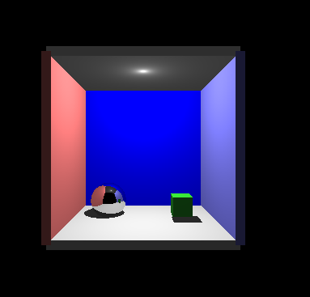
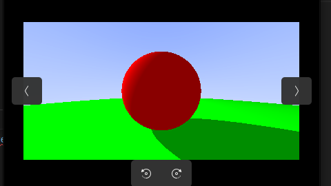

## Ray Tracer


This project implements a simple ray tracer capable of rendering 3D scenes with various materials, lighting effects, and geometric primitives.

### Defining a Scene

To define a custom scene, you need to modify the source files to include your objects:

1. **Geometric Primitives**: The code supports various primitives:
   - Spheres: Create using `sphere(center, radius, color)` or `sphere(center, radius, color, material_ptr)`
   - Cubes: Create using `cube(center, width, height, depth, color)` or with a material pointer
   - Triangles: Create using `triangle(vertex1, vertex2, vertex3, color)` or with a material pointer
   - Mesh: Load a 3D model from an OFF file and add its triangles to the scene

2. **Materials**: Different materials can be assigned to objects:
   - Metal: `std::make_shared<metal>(color(r, g, b))`
   - No material: `std::make_shared<noMaterial>()`

3. **Lighting**: Position lights in the scene by modifying the `light_pos` variable

Example: Adding objects to a scene
```cpp
// Create a scene
hittable_list world;

// Add a sphere
world.add(std::make_shared<sphere>(
    point3(0, 0, -1), 0.5, color(0.7, 0.3, 0.3), 
    std::make_shared<metal>(color(0.8, 0.8, 0.8))
));

// Add a cube
world.add(std::make_shared<cube>(
    point3(0, -1, 0), 1.0, 0.2, 1.0, color(0.8, 0.8, 0.0)
));

// Load a 3D model
offmodel* model = readOffFile("../models/house.off");
// Add triangles from the model to your scene...
```

### Building and Running

To compile and run the ray tracer:

```bash
# Compile a specific scene file
g++ room.cpp -o room
# or
g++ mesh.cpp -o mesh

# Run the compiled program (outputs a PPM file)
./room
# or
./mesh
```

### Viewing the Output

The ray tracer generates a PPM image file. To view it:

```bash
# On Linux with ImageMagick installed
display image.ppm

# Alternatively, convert to another format
convert image.ppm image.png

# On other systems, use any image viewer that supports PPM format
```

# Reference

[https://raytracing.github.io/books/RayTracingInOneWeekend.html](https://raytracing.github.io/books/RayTracingInOneWeekend.html)